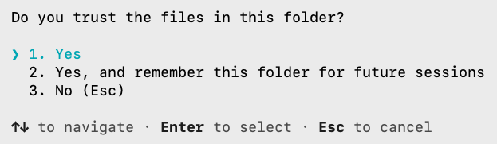
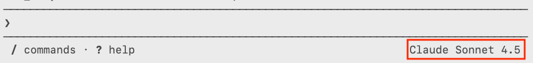
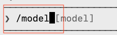
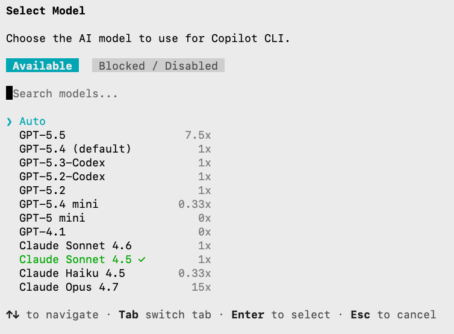

# Setup

Welcome to the workshop on the `GitHub Copilot CLI`. In order to proceed, you will need the following:

1. GitHub account
2. .NET 10
3. SQLite
4. GitHub Copilot CLI
5. If your operating system is Windows, you will need the latest version of Poweshell.

## GitHub account

If you do not already have a `GitHub` account, create one at https://github.com

## .NET 10

The current release version of .NET is version 10.0. To find out which version of .NET you have, type the following command in any terminal window on your computer:

```bash
dotnet --version
```

If you do not have .NET on your computere, or your version is older than 10.0, then visit https://dotnet.microsoft.com/en-us/download to  download and install .NET 10.0 on your computer.

## SQLite

`SQLite` is a lightweight database engine that we will use later in our tutorials. To determine whether or not you have `SQLite` installed, type the following command in any terminal window on your computer:

```bash
sqlite3 --version
```

If you do not have `SQLite`, then:
1. visit [https://dotnet.microsoft.com/en-us/download](https://sqlite.org/download.html) to  download and install it.
2. download sqlite-tools-win-x64-3530100.zip
3. Extract the zip somewhere simple like:
   ```
   C:\sqlite
   ```
4. Make sure th `sqlite3.exe` is inside that folder
5. Add C:\sqlite to PATH:
   - Press Windows key
   - Search: enviroment variables
   - Open: Edit the system enviroment Variables
   - Under User variables -> Path -> Edit
   - Click New
   - Add: `C:\sqlite`
6. Press Ok on everyhting
7. Close and reopen PowerShell
8. Run:
   ```
   sqlite3 --version
   ```

## GitHub Copilot CLI

You can find out whether or not you have the `GitHub Copilot CLI` by typing the following command in a terminal window:

```bash
copilot --version
```

If you do not have `GitHub Copilot CLI`, then visit https://docs.github.com/en/copilot/how-tos/copilot-cli/set-up-copilot-cli/install-copilot-cli and follow the instructions for your operating system.

## PowerShell (only for Windows)

If you are using macOS or Linux, you can skip this section. Otherwise, if you are on Windows, you must ensure that you have PowerShell version 7 (or later) installed on your computer.

To determine the version of PowerShell on your Windows computer, start PowerShell, then enter the following command in the window:

```bash
$PSVersionTable.PSVersion
```

If your version is older than 7.0, then update PowerShell to the latest version by typing this command in a PowerShell terminal window:

```bash
winget install Microsoft.Powershell
```

To ensure that you have the version 7 (or later) of PowerShell, type the following in a terminal window:

```bash
pwsh
```

Once you have installed all the above, you're all set and ready to go.

# Using `GitHub Copilot CLI`

To start a `GitHub Copilot CLI` session, type the following command in a terminal window:

```bash
copilot
```



If asked to trust files in current folder, type `ENTER` to confirm `Yes`.

If this is the first time using `GitHub Copilot CLI`, you must login into GitHub by typing in the `/login` command followed by `ENTER`:


Once you have successfully logged-in, you can enter any prompt into the CLI. For example, enter the following:

```
What are the top five spoken languages?
```

This is the response I received:


Note the AI model that you are using in the bottom right corner of the tool.



To change the AI model, type `/model` followed by `ENTER` in the tool:



You cann switch to another AI model by using the up and down arrows on your keyboard.



At this time the most expensive AI model is `Claude Opus 4.7` in terms of tokens as it uses 15x more tokens than `GPT-5 mini` (0x) or `GPT-4.1`.

To quit `GitHub Copilot CLI` and return to the host operating system, type `/exit` followed by `ENTER`.
