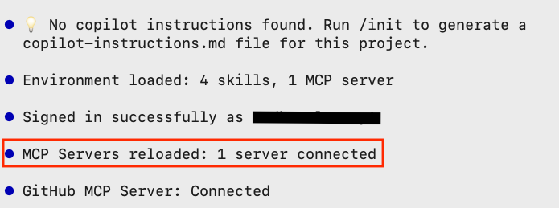

# Squad

## What is Squad?

Squad is a team of agents that work on your behalf to conduct specializations like: DevOps, Testing, DB optimization, etc. 

This is an experimental project and may change over time.

The GitHub repo for Squad is at [https://github.com/bradygaster/squad](url)

Note the following about Squad:
1. Squad works with GitHub Copilot
2. You need to have **Node.js** and **npm** (version 5.2.0 or higher) installed on your computer in order to setup Squad.
3. Using Squad can result in the consumption of a sizable amount of tokens.

## Let's take it for a spin

In the *Chinook.Web* folder created in tutorial number 2 (CRUD App), install Squad by typing the follwoing terminal window command:

```bash
npm install -g @bradygaster/squad-cli
```

Next, initialize Squad with:

```bash
squad init
```

Start a GitHub Copilot CLI session by typing the following terminal window command:

```bash
copilot
```

You must be logged into GitHub in order to use Squad. Type the following command in the input field to login into GitHub:

 

Select *GitHub.com* by hitting *ENTER* on 1.


A message is displayed that a code will be placed in the clipboard and your browser will be used for authentication once you press any key.


Your default browser will open to the *Device Activation* page.


Choose your preferred GitHub account then click on *Continue*. 


Enter the one-time code that was given to you in the GitHub Copilot CLI, then click on *Continue*. Note that it will be different from the code in the image above.


Click on *Authorize github*.


You might be required to go through the multi-function authentication process.  Once you are fully authenticated, you should received the below message in your browser:


Back in the *GitHub Copilot CLI* you will see a message that confirms that you are connected:



We will choose the Squad agent to help us improve the Chinook.Web app. In the input field, type the following command to select an agent:

```
/agent
```


