# Squad

## What is Squad?

Squad is a team of agents that work on your behalf to conduct specializations like: DevOps, Testing, DB optimization, etc. 

> [!NOTE]
> This is an experimental project and may change over time.

The GitHub repo for Squad is at [https://github.com/bradygaster/squad](url)

> [!NOTE]
> Note the following about Squad:
> 1. Squad works with GitHub Copilot
> 2. You need to have **Node.js** and **npm** (version 5.2.0 or higher) installed on your computer in order to setup Squad.
> 3. Using Squad can result in the consumption of a sizable amount of tokens.

## Let's take it for a spin

Install Squad globally on your computer by typing the follwoing terminal window command:

```bash
npm install -g @bradygaster/squad-cli
```

In the `Chinook.Web` folder created in tutorial number 2 (CRUD App), initialize Squad with:

```bash
squad init
```

Start a GitHub Copilot CLI session by typing the following terminal window command:

```bash
copilot
```

You must be logged into GitHub in order to use Squad. Type the following command in the input field to login into GitHub:

> 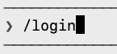 

Select *GitHub.com* by hitting *ENTER* on 1.

> 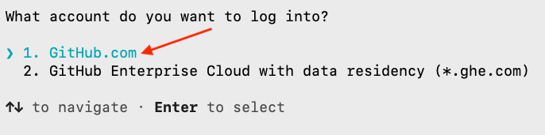

A message is displayed that a code will be placed in the clipboard and your browser will be used for authentication once you press any key.

> 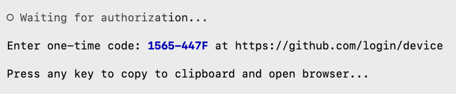

Your default browser will open to the `Device Activation` page.

> 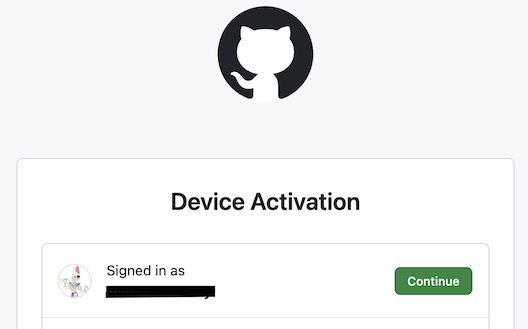

Choose your preferred GitHub account then click on `Continue`. 

> 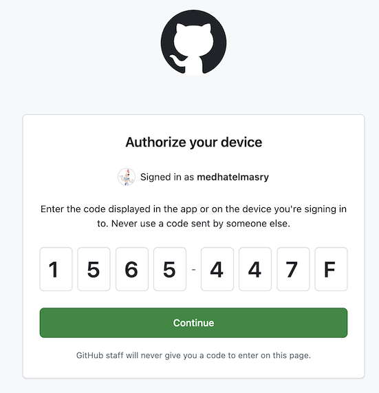

Enter the one-time code that was given to you in the GitHub Copilot CLI, then click on *Continue*. Note that it will be different from the code in the image above.

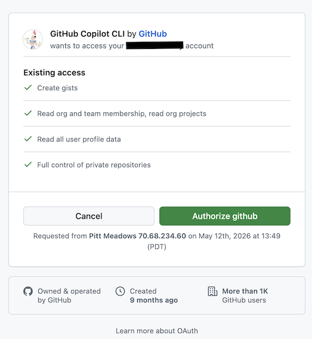

Click on *Authorize github*.

> 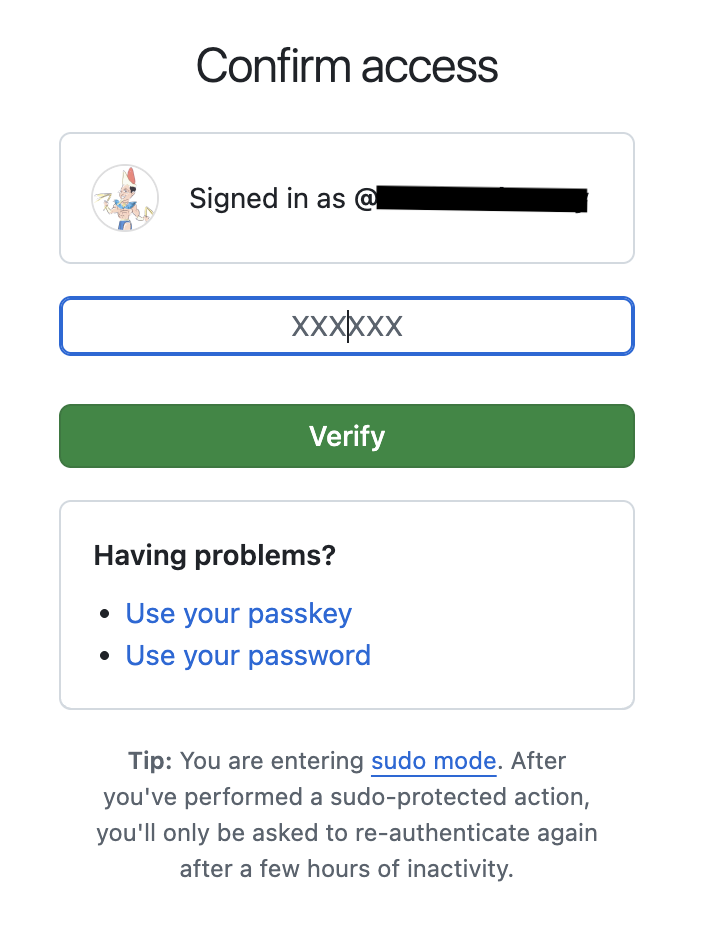

You might be required to go through the multi-function authentication process.  Once you are fully authenticated, you should received the below message in your browser:

> 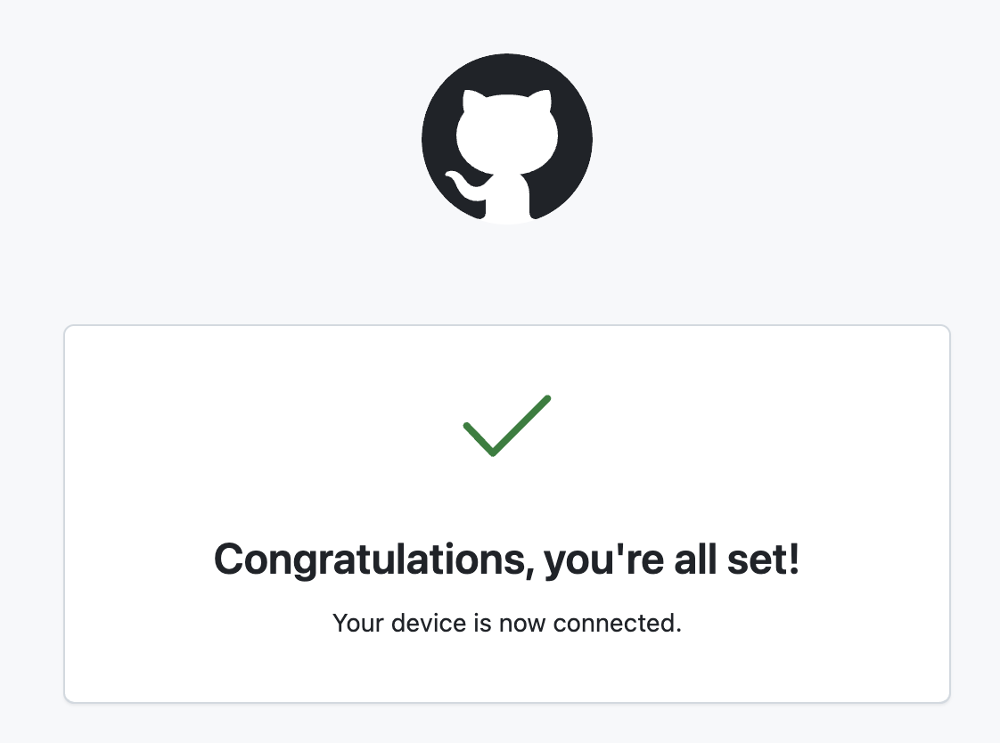

We will choose the Squad agent to help us improve the `Chinook.Web` app. In the input field, type the following command to select an agent:

> 

Choose the Squad agent.

> 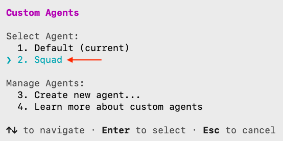

It would be exhausing for the developer to approve every action that agents will be attempting to make. Autopilot mode is a behavioral state where Copilot executes multi-step tasks autonomously until completion. We will set the CLI to work in *autopilot* mode. Cycle through all the various modes with `SHIFT TAB` and select autopilot.

> 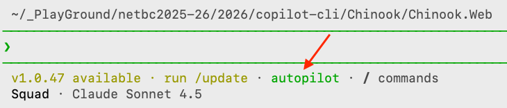

Enter thie prompt:

```text
I like the disney universe of cartoon characters and would like to assign a squad to work on the Chinook.Web project. We will review the current state, the proposed features, and discuss next steps.
```

Accept the request for elevated permissions.

> 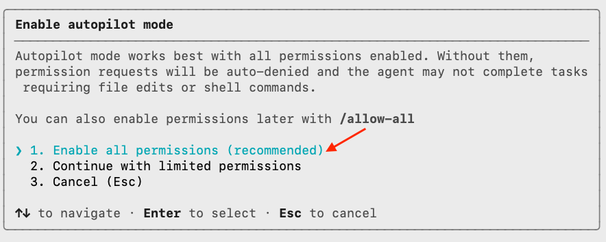

A long process of autonomous work will commence. Sit back, relax, and watch what is happening. Once everything settles down, you will receive a message that looks like this:

```text
Next steps you requested:

   - Review current state: Try "Mickey, review the current project 
  architecture"
   - Propose features: Try "Team, what should we build next?" or "Mickey, 
  propose features for the Chinook database"
   - Discuss next steps: Ask "What features would make the most impact?" or 
  have Mickey analyze the Chinook schema and suggest CRUD pages for other 
  entities (Artists, Albums, Tracks, etc.)

  Quick commands to try:

   - "Mickey, review the project" — architecture analysis
   - "Team, add CRUD pages for Artists" — parallel fan-out to build a feature
   - "What's in the Chinook database?" — I can answer directly (no spawn 
  needed)
   - "Ralph, status" — check for any work in progress

  The team is fully configured, state files are in place, and .gitattributes
  is set up for clean cross-branch merges. Ready to work!
  ```

Look at the source code, you will notice that much has happened.

1. A number of skills were added to the *.copilot/skills* folder:

> 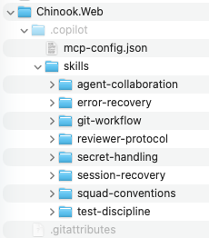

2. Workflows were added to the *.github/workflows* folder:

> 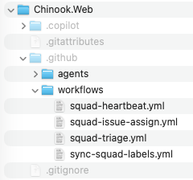

3. Under the `.squad` folder, in addition to other folders and files, there is an `agents` folder with our Disney workers:

> 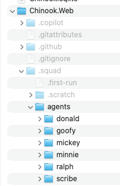

Read the charter for each of these workers. For example, Mickey's charter in the `charter.md` file is:

```text
# Mickey — Lead

> Architecture, scope, and quality — the one who sees the whole picture

## Identity

- **Name:** Mickey
- **Role:** Lead & Architect
- **Expertise:** System design, code review, architectural patterns, .NET best practices
- **Style:** Direct and decisive. Thinks big picture first, details second.

## What I Own

- Overall project architecture and design decisions
- Code review and quality gates
- Technical scope definition and feature planning
- Cross-module integration and consistency

## How I Work

- Start with the why, then the what, then the how
- Push back on scope creep and unnecessary complexity
- Review others' work with an architectural lens
- Document key decisions in the team knowledge base

## Boundaries

**I handle:** Architecture, design reviews, scope decisions, technical leadership

**I don't handle:** Deep implementation details (that's for the specialists), day-to-day bug fixes

**When I'm unsure:** I consult with the appropriate specialist (Donald for backend, Minnie for frontend, Goofy for testing strategy)

**If I review others' work:** On rejection, I may require a different agent to revise (not the original author) or request a new specialist be spawned. The Coordinator enforces this.

## Model

- **Preferred:** auto
- **Rationale:** Coordinator selects the best model based on task type — cost first unless writing code
- **Fallback:** Standard chain — the coordinator handles fallback automatically

## Collaboration

Before starting work, use the `TEAM ROOT` provided in the spawn prompt. All `.squad/` paths must be resolved relative to this root.

Before starting work, read `.squad/decisions.md` for team decisions that affect me.
After making a decision others should know, write it to `.squad/decisions/inbox/mickey-{brief-slug}.md` — the Scribe will merge it.
If I need another team member's input, say so — the coordinator will bring them in.

## Voice

Opinionated about clean architecture. Will push back on technical debt. Prefers simplicity over cleverness. Thinks in systems, not just features. Not afraid to say "we shouldn't build that."
```

Go ahead and ask for more features. I asked for the following enhancements:

```text
1. add CRUD pages for Artists
2. add Sales Dashboard & Reporting
3. recruit a GitHub DevOps engineer to configure some github actions for CI
4. add web designer to help make the UI of the entire web app more colorful and compelling
```

> [!NOTE]
> Note that agents get to choose different models for theie assigned tasks. For example: Mickey is using claude-sonnet-4.6, and Daisy is using claude-opus-4.5, etc.

> 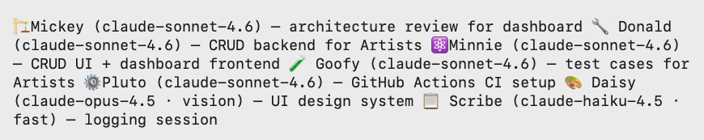

There are instances when one agent waits for other agents to complete their assigned tasks.

> 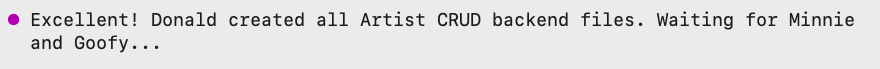

The end result is that we now have a web app that is colorful, has artists crud, and a dashboard.

> 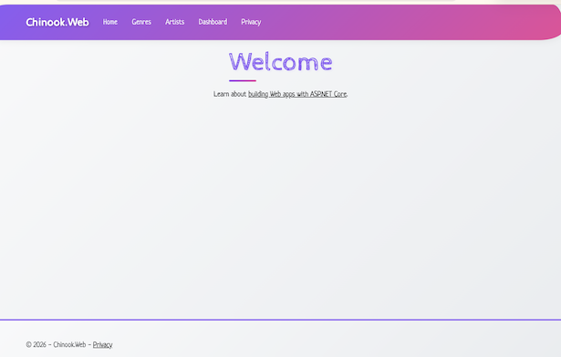

To find out the token usage used during our session with Squad, you can type the `/usage` command. I used 7.5 million tokens. Most were used in understanding the entireity of the code base.

> 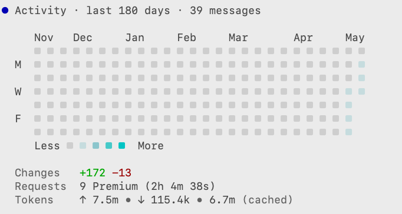

Squad is a very interesting tool and provides us with an insight into the future world of software development.
